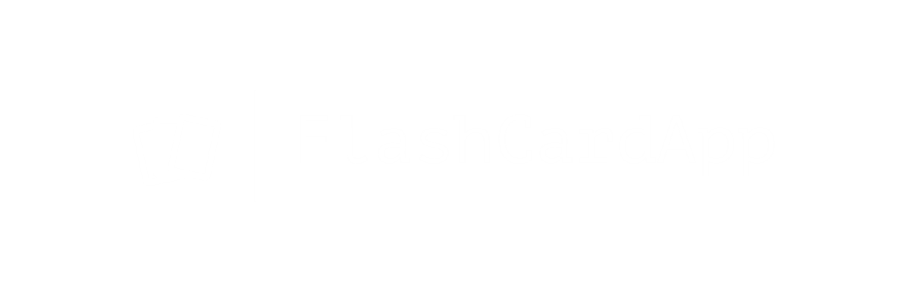
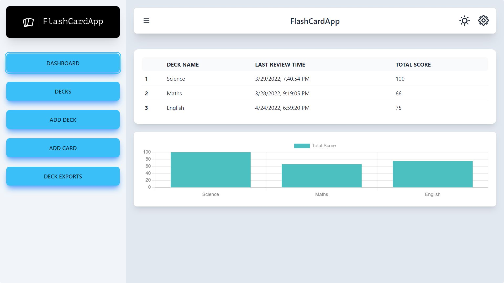

<br>

<div align="center">
  <a href="https://github.com/Rahul-7323/FlashCardApp">
    
  </a>


</div>

## About The Project



<ul>
<li>
A flashcard is a card bearing information on both sides, which is intended to be used as an aid for memorization.</li>
<li>The front portion of a flashcard contains a cue or a question or a hint and the back portion of the flashcard contains the answer to it. 
</li>
<li>
A deck is a collection of related cards. For example, a Japanese Deck contains Cards related to the Japanese language where the front portion of each card could be a word in English and the back portion of the card is the Japanese translation of the English word.
</li>
<li>
In this project a Single Page Application and an accompanying API has been created which implements Flashcards. This web app has been created using Flask and VueJS. It has some core functionalities such as user login, dashboard, review, deck management, validations, server sent events, async exports, webhooks, Redis and celery for backend jobs, and uses Tailwindcss for styling.

</li>
</ul>


## Frameworks and Technologies Used

* The Flask framework was used for developing the backend. Especially for the API.

* The API endpoints of Flask-Security were used for implementing the Login/Logout/Register
system.
* Flask-SQLAlchemy and SQLite were used for the Database.
* Flask-RESTful was used for implementing the RESTful API.
* Redis and Celery were used for implementing task workers, message queues and job scheduling in the backend.
* Discord webhooks have been used for sending daily remainders.
* The VueJS ecosystem of frameworks, namely Vue 3, Vue-Router for routing and Pinia for state management were used for building the frontend.
* Tailwindcss and DaisyUI for styling

<br><br>


## Getting Started

<b>You need Docker in order to run this application.</b>
Since this application uses Redis and Celery which are not supported on Windows, you need to have Docker and WSL installed in Windows in order to run this application.
<br><br>


## Running the application

Since I have created a docker-compose.yml file with all the necessary instructions for the application, starting the application should be fairly simple. Docker will pull all the necessary images and dependencies for running the application so no prior setup is required. Just run the below command in the terminal at the root directory of the project.<br><br>
```
docker-compose up -d
```
After a few seconds, you should now be able to access the app at http://localhost:8080

## Usage

After the application is up and running, you can start using and play around with its features. For any doubts related to using the app, please watch the [presentation video](https://drive.google.com/file/d/19E_UiLdPfhVD9tEHFZyD2EvKDI6YUsjw/view).
<br><br>
